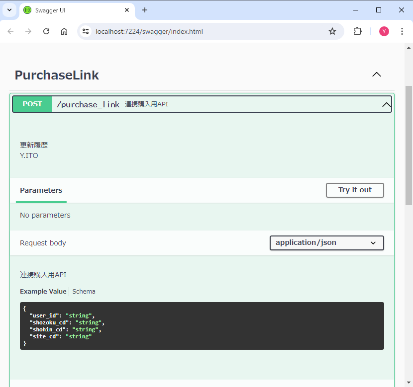

# OpenAPIでGOF生成パターンを制覇しよう + ＠

## はじめに
これまで自身が作成した関数やよく使用した技術をポートフォリオ用に一つのプロジェクトにまとめました。基本的にいくつかリポジトリはありますがこちらを見ていただければ充分だと思います。

本リポジトリはOpenAPI(RESTfulAPI)の基盤部構築における工夫をまとめた技術資料で複数のECサイトが連携するプラットフォームを例としています。 ※ ビジネスロジックはありません

GOFの生成パターンを一度に全て使用してみたいと思い、各生成過程で拡張性、再利用性、一貫性等様々な特性が求められる、API基盤部の複雑なオブジェクト生成部に主に適用しています。

以下では本APIの基盤アクセスオブジェクト群であるAccesors生成を中心に解説していますが、全て見ていただくのは大変ですので
##### [GitLink(click here)：Factoryパターン.FactoryMethodパターン](https://github.com/casharine/TestECPlatformWebAPI/blob/main/Documents/GOF.Factory%E3%83%91%E3%82%BF%E3%83%BC%E3%83%B3.AbstractFactory%E3%83%91%E3%82%BF%E3%83%BC%E3%83%B3%26FactoryMethod%E3%83%91%E3%82%BF%E3%83%BC%E3%83%B3.md)
 ##### [GitLink(click here)：その他.DisplayEnumsレスポンスステータスを賢く返したい](https://github.com/casharine/TestECPlatformWebAPI/blob/main/Documents/MyComonLibrary/DisplayEnums%E3%83%AC%E3%82%B9%E3%83%9D%E3%83%B3%E3%82%B9%E3%82%B9%E3%83%86%E3%83%BC%E3%82%BF%E3%82%B9%E3%82%92%E8%B3%A2%E3%81%8F%E8%BF%94%E3%81%97%E3%81%9F%E3%81%84.md)

だけでも御覧いただけると幸いです。

ソース中には他にもGOFを適用している箇所やそれ以外にもオリジナルのレスポンスステータスの返し方や各種共通関数も多数作成していますのでよろしければ併せましてご確認ください。

## 全体のソースコード
全体のソースコードをソリューション（C#のプロジェクト群）として公開しております。
##### [GitLink(click here)：ソース](https://github.com/casharine/TestECPlatformWebAPI/tree/main/Source/TestECPlatformWebAPI)

## リンク集
##### [GitLink(click here)：プロジェクトTOP](https://github.com/casharine/TestECPlatformWebAPI/tree/main)
##### [GitLink(click here)：Readme](https://github.com/casharine/TestECPlatformWebAPI/tree/main)
##### [GitLink(click here)：解説ドキュメントTOP](https://github.com/casharine/TestECPlatformWebAPI/tree/main/Documents)

## 技術資料
上記ソースの工夫点を以下のリンクから生成パターンごとに解説していきます。

本プロジェクトでは、少し複雑になりますがFactoryパターンを入れ子構造に展開し、クライアントサイトが自社サイトの購入処理を行うか他社サイトの購入処理を行うかによって適切なオブジェクト群を一括生成できるようにプログラムしました。

### GOFのCreational Patterns（生成パターン）
GOFデザインパターンの生成パターンと呼ばれるものは以下の5種類です。ソースと併せて解説いたします。

##### 1. [GitLink(click here)：Factoryパターン.AbstractFactoryパターン](https://github.com/casharine/TestECPlatformWebAPI/blob/main/Documents/CreationalPatternsLibrary/GOF.Factory%E3%83%91%E3%82%BF%E3%83%BC%E3%83%B3.AbstractFactory%E3%83%91%E3%82%BF%E3%83%BC%E3%83%B3%26FactoryMethod%E3%83%91%E3%82%BF%E3%83%BC%E3%83%B3.md)  難易度：★★★★
   Accesors関連のオブジェクト群生成に使用しました、具体的な生成ロジックをクライアントから分離しています
##### 2.  [GitLink(click here)：Factoryパターン.FactoryMethodパターン](https://github.com/casharine/TestECPlatformWebAPI/blob/main/Documents/CreationalPatternsLibrary/GOF.Factory%E3%83%91%E3%82%BF%E3%83%BC%E3%83%B3.AbstractFactory%E3%83%91%E3%82%BF%E3%83%BC%E3%83%B3%26FactoryMethod%E3%83%91%E3%82%BF%E3%83%BC%E3%83%B3.md) 難易度：★★★
   Accesors関連オブジェクト群生成、メソッド単位で抽象化し多態性を持たせるようにしています
##### 3. [GitLink(click here)Builderパターンパターン](https://github.com/casharine/TestECPlatformWebAPI/blob/main/Documents/CreationalPatternsLibrary/GOF.Builder%E3%83%91%E3%82%BF%E3%83%BC%E3%83%B3.md) 難易度：★★★
   AccessorのBuild部に使用。ジェネリクス型引数に対応させるアレンジをしています（Factoryパターンではありません）
##### 4. [GitLink(click here)：Factoryパターン.Singletonパターン](https://github.com/casharine/TestECPlatformWebAPI/blob/main/Documents/CreationalPatternsLibrary/GOF.Factory%E3%83%91%E3%82%BF%E3%83%BC%E3%83%B3.Singleton%E3%83%91%E3%82%BF%E3%83%BC%E3%83%B3.md) 難易度：★★
   ロックオブジェクト生成・取得に使用しました。一意性を担保することでグローバルアクセスポイントとしています
##### 5. [GitLink(click here)：Factoryパターン.Prototypeパターン](https://github.com/casharine/TestECPlatformWebAPI/blob/main/Documents/GOF.Factory%E3%83%91%E3%82%BF%E3%83%BC%E3%83%B3.Prototype%E3%83%91%E3%82%BF%E3%83%BC%E3%83%B3.md](https://github.com/casharine/TestECPlatformWebAPI/blob/main/Documents/CreationalPatternsLibrary/GOF.Factory%E3%83%91%E3%82%BF%E3%83%BC%E3%83%B3.Prototype%E3%83%91%E3%82%BF%E3%83%BC%E3%83%B3.md)) 難易度：★
   連携先の結果オブジェクトを複製するために使用しました。クライアント側の記述がシンプルになります

### GOF以外の生成パターン
##### 1.[GitLink(click here)：Factoryパターン.SimpleFactoryパターン](https://github.com/casharine/TestECPlatformWebAPI/blob/main/Documents/CreationalPatternsLibrary/Factory%E3%83%91%E3%82%BF%E3%83%BC%E3%83%B3.SimpleFactory%E3%83%91%E3%82%BF%E3%83%BC%E3%83%B3.md)  難易度：★
   最終的な購入処理クラスインスタンス化ロジックを一箇所に集めカプセル化しています

※ Factoryパターンとは
オブジェクト生成を抽象化する方法全般を指します。オブジェクトの生成をカプセル化するデザインパターンの一種で、具体的な生成方法をクライアントコードから分離する事ができます。

### その他のドキュメント
##### 1. [GitLink(click here)：その他.NetCoreでAppsettings.jsonを自由に設定する](https://github.com/casharine/TestECPlatformWebAPI/blob/main/Documents/MyComonLibrary/.NetCore%E3%81%A7Appsettings.json%E3%82%92%E8%87%AA%E7%94%B1%E3%81%AB%E8%A8%AD%E5%AE%9A%E3%81%99%E3%82%8B.md)
##### 2. [GitLink(click here)：その他.NetCoreでSwaggerを使用したRestAPI構築する](https://github.com/casharine/TestECPlatformWebAPI/blob/main/Documents/MyComonLibrary/.NetCore%E3%81%A7Swagger%E3%82%92%E4%BD%BF%E7%94%A8%E3%81%97%E3%81%9FRestAPI%E6%A7%8B%E7%AF%89%E3%81%99%E3%82%8B.md)
##### 3. [GitLink(click here)：その他.DisplayEnumsレスポンスステータスを賢く返したい](https://github.com/casharine/TestECPlatformWebAPI/blob/main/Documents/MyComonLibrary/DisplayEnums%E3%83%AC%E3%82%B9%E3%83%9D%E3%83%B3%E3%82%B9%E3%82%B9%E3%83%86%E3%83%BC%E3%82%BF%E3%82%B9%E3%82%92%E8%B3%A2%E3%81%8F%E8%BF%94%E3%81%97%E3%81%9F%E3%81%84.md)

### Swaggerデバック状態
デプロイはしておりませんがローカルでプロジェクトは立ち上げております

## 所感
難しいと感じた順に記述しています。実務で初めて挑戦したのはAbstractFactoryパターンでしたが社内に参考にするソースもなくとても四苦八苦しながら取り組んだ事を思いだします。。。その後はAbstractFactoryパターンさえ分かってしまえば都度すんなり新しパターンを試したりしてきましたがInterfaceや抽象クラスが何となくわかる方はAbstractFactoryパターンから入れば後は簡単だと思います。個人的にAbstractFactoryパターンとBuilderパターン、Singletonパターン辺りがデザインパターンとして面白かったです。

## 補足事項
- カプセル化にアクセス修飾子internalを使用していますがJavaでいうpackage-privateと近いと思います
- 主なプリフィックスは以下の通りです
    - I：Interface
    - i: in(引数)
    - w: work(ローカル変数)
    - r: ref(in out型)
- Accesorsの役割
    - getCode：本アクセサの対象ECサイトのコードを取得します（APIサーバーの場合は空文字）
    - getConnectionString：ECサイト毎のDB接続文字列を取得します
    - getAppsettings：Appsettings.json(.netCoreのコンフィグ)へのアクセサオブジェクトを取得します
    - getConnection：今回はOracleConnectionを想定してDBコネクションオブジェクトを取得します
    - getLoggerAPI：APIサーバーのログテーブルへ書き込みを行うオブジェクトを取得します
    - getLoggerClient：ECサイト毎のログテーブルへ書き込みを行うオブジェクトを取得します
    - getLockObject：ECサイト毎の購入時のロックオブジェクトを取得します。
  
## 参考文献
- Java言語で学ぶデザインパターン入門第3版 Kindle版 結城 浩